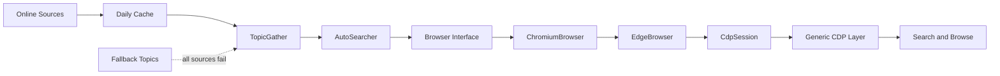

<div align="center">

# AutoSearcher

Extensible, human-paced web search automation for Windows and Microsoft Edge.

   

**English** · [简体中文](README.zh-CN.md)

</div>

AutoSearcher gathers trending topics from multiple sources, removes duplicates,
caches daily results, and searches them one by one in Microsoft Edge. Browser
interactions use paced typing, short dwell times, pointer movement, and segmented
scrolling to reproduce an ordinary interactive workflow.

The project only covers **topic collection → browser search → result browsing**.
It contains no account, sign-in, reward, or points logic.

> [!IMPORTANT]
> Edge 151 WebSocket/CDP support is experimental until it has been verified on
> additional machines. Enable remote debugging in `edge://inspect` before using
> a normal Edge 151 profile.

## ✨ Highlights

- Aggregates Baidu, Tencent, and Toutiao trending topics.
- Isolates source failures so one unavailable provider does not stop the others.
- Stores an independent daily cache for each online source.
- Uses a local fallback topic file only when every online source returns no data.
- Starts a new Edge session or attaches to a running debuggable Edge instance.
- Resolves the current Windows Edge user-data directory and last-used profile.
- Encapsulates browser interaction, source access, caching, and orchestration.
- Ships as a portable Windows ZIP that does not require Python on the target PC.

## 🗺️ Roadmap

- [x] Add experimental Edge 151 WebSocket/CDP session attachment.
- [x] Use one CDP backend for supported Edge versions.
- [ ] Validate Edge 151 attachment and launch behavior on additional machines.
- [x] Separate browser, backend, and interaction responsibilities.
- [ ] Build a desktop GUI on top of the stable application interfaces.
- [ ] Add clearer release versioning and automated GitHub builds.

## 🧭 How It Works



The main dependencies point inward toward small interfaces:

- `AutoSearcher` coordinates the run through the `Browser` contract.
- `ChromiumBrowser` implements shared CDP discovery, launch, and session flow.
- `EdgeBrowser` supplies only Edge-specific executable, process, product, and debugging rules.
- `CdpSession` controls any compatible browser through a generic `Endpoint`.
- `CdpInteraction` implements typing, clicking, and result browsing through CDP.
- `TopicGather` owns source fallback, aggregation, shuffling, and deduplication.
- `CachedSource` adds HTTP retrieval and optional daily caching to the `Source` contract.
- `schemas` contains configuration and search data structures only.

## 🚀 Quick Start

### Portable package

Requirements:

- Windows 10 or 11 x64
- Microsoft Edge

Extract `AutoSearcher-portable-win-x64.zip`, then run:

```powershell
.\check.cmd
.\check_edge_port.cmd
.\run.cmd
```

The target machine does not need Python, an external browser driver, or project
dependencies.

### Run from source

```powershell
git clone <repository-url>
cd AutoSearcher
python -m venv .venv
.\.venv\Scripts\Activate.ps1
python -m pip install -e .
auto-searcher check
auto-searcher
```

Python 3.11 or newer is required. The project uses a standard `src` layout, so an
editable install is recommended for development.

## 🖥️ Commands

```text
auto-searcher [options] [{run,check,topics}]
```

| Command | Purpose |
| --- | --- |
| `run` | Collect topics and perform the complete search workflow; this is the default. |
| `check` | Validate configuration and show resolved paths. |
| `topics` | Collect and print topics without opening Edge. |

Common examples:

```powershell
# Run with the default configuration
auto-searcher

# Validate a specific configuration
auto-searcher --config config/config.yaml check

# Print up to 20 aggregated topics
auto-searcher topics --limit 20

# Debug one source without cache or fallback data
auto-searcher topics --source baidu --limit 10

# Enable diagnostic logging
auto-searcher --verbose
```

Available source names are `baidu`, `tencent`, and `toutiao`.

## ⚙️ Configuration

The default configuration is [config/config.yaml](config/config.yaml):

```yaml
browser:
  type: edge
  page_timeout_seconds: 20

search:
  url: https://www.bing.com
  count: 3
  interval_seconds: [3, 5]
  typing_delay_seconds: [0.08, 0.20]
  scroll_count: [3, 6]
  scroll_pause_seconds: [1.5, 3]

sources:
  enabled:
    - baidu
    - tencent
    - toutiao
  request_timeout_seconds: 10
  fallback_file: ../data/fallback_topics.txt
```

### Browser

| Field | Description |
| --- | --- |
| `type` | Browser implementation. Only `edge` is currently available. |
| `user_data_dir` | Edge user-data root. Omit it to use `%LOCALAPPDATA%\Microsoft\Edge\User Data`. |
| `profile_name` | Profile directory such as `Default` or `Profile 1`. Omit it to read Edge's last-used profile. |
| `debugger_address` | Explicit address such as `127.0.0.1:9222`. Omit it for live discovery, or set it to `null` to skip attachment. |
| `page_timeout_seconds` | Page navigation and element wait timeout. |

When `profile_name` is omitted, AutoSearcher reads `Local State` from the selected
user-data root and falls back to `Default` if no valid last-used profile is found.

### Search

| Field | Description |
| --- | --- |
| `url` | Search engine home page. |
| `count` | Number of searches in one run. |
| `interval_seconds` | Random delay range between searches. |
| `typing_delay_seconds` | Delay range between individual keystrokes. |
| `scroll_count` | Range of segmented result-page scrolls. |
| `scroll_pause_seconds` | Pause range after each scroll. |

The current page adapter locates the query input by `name="q"` and identifies
results through the `/search` URL. Other search engines may require a dedicated
page adapter.

### Sources

| Field | Description |
| --- | --- |
| `enabled` | Enabled source names in collection order. |
| `request_timeout_seconds` | Timeout for each source request. |
| `cache_dir` | Optional cache directory. |
| `fallback_file` | Local topics used only when all online sources return no data. |

The default cache path is:

```text
%LOCALAPPDATA%\AutoSearcher\cache\sources\<source>.json
```

Each source cache is valid only for the day it was created. Missing, expired,
empty, or damaged caches are fetched again. The fallback file uses one topic per
line; blank lines and lines beginning with `#` are ignored.

## 🌐 Edge Sessions

| Configuration | Behavior |
| --- | --- |
| `debugger_address` omitted | Detect Edge 131 through live HTTP DevTools listeners, or validate Edge 151 through the browser WebSocket recorded in `DevToolsActivePort`. |
| `debugger_address: host:port` | Try only the configured endpoint. |
| `debugger_address: null` | Skip attachment and start a new browser. |
| No attachable Edge found | Start Edge on port `9222` when available; otherwise let Edge choose a free port. |

For Edge 151, enable remote debugging from `edge://inspect` once. AutoSearcher
then reads the browser-level WebSocket path, opens a dedicated tab through CDP,
and closes only that tab after an attached run. If Edge 151 is not running,
AutoSearcher starts the normal profile and waits for the enabled WebSocket
service.

An attached session receives a new tab, and AutoSearcher closes only that tab at
the end. A browser started by AutoSearcher is owned by the program and is closed
when the run finishes.

To expose a classic debugging endpoint manually:

```powershell
& "$env:ProgramFiles(x86)\Microsoft\Edge\Application\msedge.exe" `
  --remote-debugging-port=9222 `
  --user-data-dir="D:\Temp\EdgeDebugProfile"
```

The same Edge user-data root cannot be opened by two browser processes at once.
If no attachable endpoint exists, close all Edge background processes before
asking AutoSearcher to launch the default user profile.

## 🧩 Project Layout

```text
AutoSearcher/
├─ src/auto_searcher/
│  ├─ __main__.py          CLI and dependency assembly
│  ├─ auto_searcher.py     Search workflow coordinator
│  ├─ topic_gather.py      Topic aggregation and fallback
│  ├─ browsers/            Browser implementations
│  │  ├─ browser.py          Browser interface
│  │  ├─ chromium_browser.py Shared Chromium flow
│  │  ├─ edge_browser.py     Edge implementation and runtime helpers
│  │  └─ cdp/                Low-level CDP connection, endpoint, and page
│  ├─ schemas/             Configuration and search structures
│  ├─ sources/             Source hierarchy and daily cache
│  │  ├─ source.py           Source interface
│  │  ├─ cached_source.py    Shared HTTP and cache flow
│  │  └─ *_source.py         Provider-specific implementations
│  └─ utils/               Configuration and path helpers
├─ tests/                  Unit tests
├─ config/                 Default configuration
├─ data/                   Fallback topics
├─ packaging/              PyInstaller specification and launchers
├─ scripts/                Build implementation
├─ build.cmd               One-click portable build
└─ pyproject.toml          Package metadata and dependencies
```

### Add a source

For a JSON HTTP API, subclass `CachedSource` and implement `name`, `url`, and
`parse()`. Pass a cache directory to enable daily caching, or `None` to bypass
it. Then export the class from `sources`, register it in the CLI source
map, add its name to `sources.enabled`, and cover the parser with an offline unit
test. Non-HTTP sources can implement `Source.fetch()` directly.

## 🛠️ Development

Run the complete offline test suite:

```powershell
python -m unittest discover -s tests -v
```

Tests use fake browsers and in-memory sources. They do not open Edge or call the
live trending-topic APIs.

Build the portable package by double-clicking `build.cmd` or running:

```bat
build.cmd
```

The output is written to:

```text
dist\AutoSearcher-portable-win-x64.zip
```

The build creates an isolated `.build-venv`, runs PyInstaller, copies runtime
configuration and documentation, validates the packaged executable, and creates
the ZIP archive.

## ⚠️ Notes

- Search engine markup and external topic APIs can change without notice.
- Interaction pacing reproduces a normal workflow but does not guarantee that a
  website will classify the session as human-operated.
- Use the project in accordance with website terms, rate limits, and applicable law.
