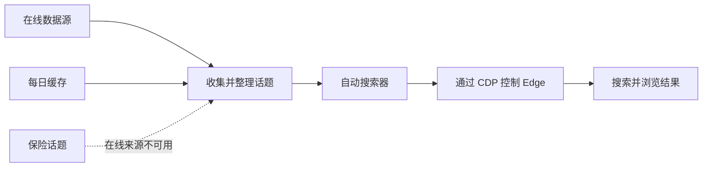

<div align="center">

# AutoSearcher

面向 Windows 与 Microsoft Edge 的可扩展、自然节奏网页自动搜索工具。

   

[English](README.md) · **简体中文**

</div>

AutoSearcher 从多个热点来源收集话题，完成去重和每日缓存，然后在 Microsoft
Edge 中逐条搜索。浏览器交互采用逐字输入、短暂停留、鼠标移动和分段滚动，
用于还原普通的交互操作流程。

项目只负责 **话题获取 → 浏览器搜索 → 结果页浏览**，不包含账号、登录、积分
或奖励逻辑。

> [!IMPORTANT]
> 使用浏览器管理的调试会话前，请先在 `edge://inspect` 中启用远程调试。

## ✨ 功能亮点

- 聚合百度、腾讯和头条热点话题。
- 数据源独立容错，单个来源不可用不会中断其他来源。
- 每个在线数据源拥有独立的当日缓存。
- 仅在所有在线来源均无结果时启用本地保险话题。
- 可以启动新的 Edge，或接管已启用远程调试的 Edge。
- 使用当前 Windows 用户的 Edge 数据目录自动发现 CDP 端点。
- 将浏览器交互、数据源访问、缓存和流程协调拆分为独立组件。
- 提供目标机器无需安装 Python 的 Windows 便携 ZIP。

## 🗺️ 开发计划

- [x] 通过 CDP 支持启动 Edge 和接管已有会话。
- [x] 实现多来源话题获取、每日缓存和本地保险数据。
- [ ] 基于稳定的应用接口开发桌面图形界面。
- [ ] 通过 GitHub Actions 自动测试并构建发行包。

## 🧭 工作原理



程序首先读取当日缓存，或者从已启用的数据源获取最新话题；所有在线来源均不可用
时，改用本地保险文件。话题完成去重和随机排序后，程序接管正在运行的 Edge，
或者启动新的 Edge，再通过 CDP 逐条搜索并浏览结果页。

## 🚀 快速开始

### 便携版

运行要求：

- Windows 10/11 x64
- Microsoft Edge

解压 `AutoSearcher-portable-v0.1.0-win-x64.zip`，依次运行：

```powershell
.\check.cmd
.\run.cmd
```

目标机器不需要安装 Python、额外的浏览器驱动或项目依赖。

### 从源码运行

```powershell
git clone <repository-url>
cd AutoSearcher
python -m venv .venv
.\.venv\Scripts\Activate.ps1
python -m pip install -e .
auto-searcher check
auto-searcher
```

源码运行要求 Python 3.11 或更高版本。项目采用标准 `src` 布局，开发时建议
使用可编辑安装。

## 🖥️ 命令行

```text
auto-searcher [options] [{run,check,topics}]
```

| 命令 | 作用 |
| --- | --- |
| `run` | 获取话题并执行完整搜索；这是默认命令。 |
| `check` | 检查配置并显示解析后的路径。 |
| `topics` | 仅获取并显示话题，不打开 Edge。 |

常用示例：

```powershell
# 使用默认配置运行
auto-searcher

# 检查指定配置
auto-searcher --config config/config.yaml check

# 显示最多 20 条聚合话题
auto-searcher topics --limit 20

# 绕过缓存和保险数据，单独调试百度来源
auto-searcher topics --source baidu --limit 10

# 输出诊断日志
auto-searcher --verbose
```

可用来源名称为 `baidu`、`tencent` 和 `toutiao`。

## ⚙️ 配置

默认配置位于 [config/config.yaml](config/config.yaml)：

```yaml
browser:
  type: edge
  page_timeout_seconds: 20
  args: []

search:
  url: https://www.bing.com
  count: 3
  interval_seconds: [3, 5]
  typing_delay_seconds: [0.08, 0.20]
  scroll_count: [3, 6]
  scroll_pause_seconds: [1.5, 3]

sources:
  enabled:
    - baidu
    - tencent
    - toutiao
  request_timeout_seconds: 10
  fallback_file: ../data/fallback_topics.txt
```

### 浏览器

| 字段 | 说明 |
| --- | --- |
| `type` | 浏览器实现，目前仅支持 `edge`。 |
| `args` | 可选的 Edge 启动参数列表，支持有值参数和无值开关。 |
| `page_timeout_seconds` | 页面跳转与元素等待超时。 |

例如指定用户数据目录、浏览器配置文件、调试端口和无值开关：

```yaml
browser:
  type: edge
  page_timeout_seconds: 20
  args:
    - "--user-data-dir=%LOCALAPPDATA%/Microsoft/Edge/User Data"
    - "--profile-directory=Profile 1"
    - "--remote-debugging-port=9224"
    - "--start-maximized"
```

参数中的环境变量会自动展开。无值开关直接写成一个字符串即可。
对于旧版 Edge，配置的调试端口会被使用；省略时默认使用 `9222`。对于启用了
浏览器内置远程调试的新版 Edge，该参数会产生警告并被自动忽略。

### 搜索

| 字段 | 说明 |
| --- | --- |
| `url` | 搜索引擎首页。 |
| `count` | 单次运行的搜索次数。 |
| `interval_seconds` | 两次搜索之间的随机等待范围。 |
| `typing_delay_seconds` | 每个字符之间的输入延迟范围。 |
| `scroll_count` | 结果页分段滚动次数范围。 |
| `scroll_pause_seconds` | 每次滚动后的停留时间范围。 |

当前页面适配器通过 `name="q"` 定位搜索框，并通过 `/search` 判断结果页。
其他搜索引擎可能需要实现独立的页面适配器。

### 数据源

| 字段 | 说明 |
| --- | --- |
| `enabled` | 启用的数据源名称及收集顺序。 |
| `request_timeout_seconds` | 单个来源的请求超时。 |
| `cache_dir` | 可选缓存目录。 |
| `fallback_file` | 所有在线来源均无结果时使用的本地话题文件。 |

默认缓存位置：

```text
%LOCALAPPDATA%\AutoSearcher\cache\sources\<source>.json
```

每个来源的缓存仅在生成当天有效。缓存不存在、过期、为空或损坏时会重新请求。
保险文件每行一个话题，空行和以 `#` 开头的行会被忽略。

## 🌐 浏览器会话

| 环境 | 行为 |
| --- | --- |
| 已有可接管的 Edge | 自动从 `DevToolsActivePort` 或 Edge 的监听端口发现 CDP。 |
| 已启用 `edge://inspect/#remote-debugging` 开关 | 启动 Edge 时不传调试端口，由浏览器管理远程调试。 |
| 没有该开关的旧版 Edge | 启动时自动传入内部兼容端口 `9222`。 |

程序读取 Edge 用户数据根目录下 `Local State` 中与
`edge://inspect/#remote-debugging` 对应的浏览器级状态，自动选择启动方式。
由浏览器管理远程调试时，程序会警告并忽略配置的端口；使用传统调试方式时，
程序采用配置的端口，未配置则使用 `9222`。其他启动参数保持原样传入。

Edge 151 需要先在 `edge://inspect` 中启用一次远程调试。之后 AutoSearcher
读取浏览器级 WebSocket 地址，通过 CDP 创建独立标签页；接管运行结束时只关闭
该标签页。如果 Edge 尚未运行，AutoSearcher 会正常启动它，然后等待已启用的
WebSocket 服务。

接管已有会话时，AutoSearcher 会新建标签页，任务结束后只关闭该标签页。由
AutoSearcher 启动的浏览器归程序所有，任务结束时会关闭整个浏览器实例。

手动开放经典调试端点：

```powershell
& "$env:ProgramFiles(x86)\Microsoft\Edge\Application\msedge.exe" `
  --remote-debugging-port=9222 `
  --user-data-dir="D:\Temp\EdgeDebugProfile"
```

同一个 Edge 用户数据根目录不能同时由两个浏览器进程打开。如果没有可接管的
端点，请先彻底关闭 Edge 后台进程，再让 AutoSearcher 启动默认用户配置。

## 🧩 项目结构

```text
AutoSearcher/
├─ src/auto_searcher/
│  ├─ __main__.py          命令行入口与依赖组装
│  ├─ auto_searcher.py     搜索流程协调器
│  ├─ topic_gather.py      话题聚合与保险切换
│  ├─ browsers/            浏览器实现
│  │  ├─ browser.py          浏览器接口
│  │  ├─ chromium_browser.py Chromium 通用流程
│  │  ├─ edge_browser.py     Edge 实现及运行环境辅助函数
│  │  └─ cdp/                CDP 连接、端点与页面底层
│  ├─ schemas/             配置与搜索数据结构
│  ├─ sources/             数据源层次与每日缓存
│  │  ├─ source.py           数据源接口
│  │  ├─ cached_source.py    通用 HTTP 与缓存流程
│  │  └─ *_source.py         各平台数据源实现
│  └─ utils/               配置及路径工具
├─ tests/                  单元测试
├─ config/                 默认配置
├─ data/                   保险话题
├─ packaging/              PyInstaller 配置与启动脚本
├─ scripts/                构建实现
├─ build.cmd               一键便携打包
└─ pyproject.toml          包信息与依赖
```

### 扩展数据源

基于 HTTP 的 JSON 接口可以继承 `CachedSource`，实现 `name`、`url` 和 `parse()`。
传入缓存目录即可启用每日缓存，传入 `None` 则绕过缓存。随后从 `sources`
导出类、在命令行的数据源映射中注册、将名称加入
`sources.enabled`，并为解析器补充不访问网络的单元测试。非 HTTP 来源可以
直接实现 `Source.fetch()`。

## 🛠️ 开发

运行完整的离线测试：

```powershell
python -m unittest discover -s tests -v
```

测试使用模拟浏览器和内存数据源，不会打开 Edge，也不会访问在线热点接口。

双击 `build.cmd`，或在终端运行：

```bat
build.cmd
```

输出文件：

```text
dist\AutoSearcher-portable-v0.1.0-win-x64.zip
```

构建过程会创建隔离的 `.build-venv`、运行 PyInstaller、复制运行配置与文档、
验证打包后的可执行文件，然后生成 ZIP。

## ⚠️ 注意事项

- 搜索引擎页面结构和外部热点接口可能随时变化。
- 交互节奏用于还原普通操作流程，但不能保证网站将会话判断为人工操作。
- 请遵守目标网站的服务条款、访问频率限制和所在地适用法律。
